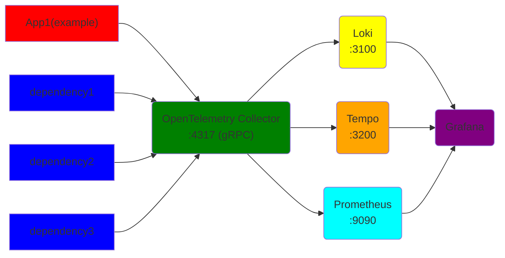
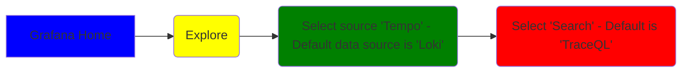
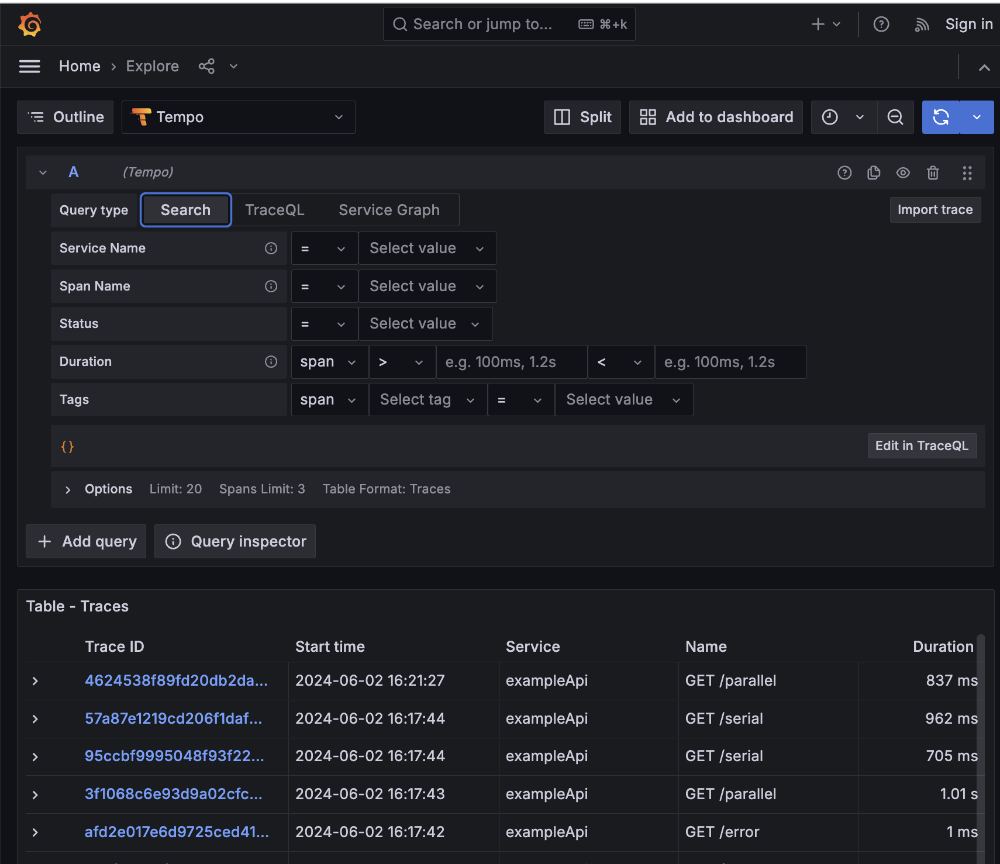
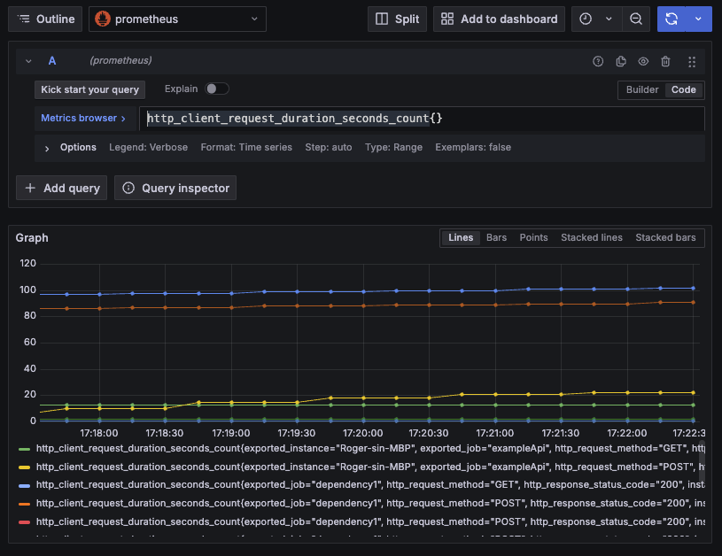
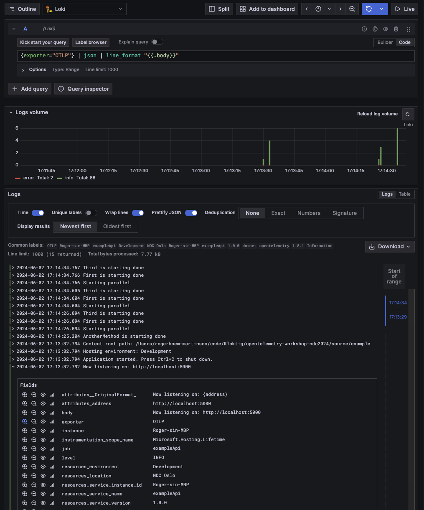

# OpenTelemetry Workshop
This setup is based on: https://github.com/open-telemetry/opentelemetry-collector-contrib/tree/main/examples/demo

## Alternative setup
If you want a simplified setup with a single container, you can use https://github.com/grafana/docker-otel-lgtm/. This is mained by Grafana.

## Prerequisites
* Tool for building and running containers, e.g. Docker Desktop, Podman or Rancher Desktop - Including Compose.
* Dotnet 8

## Overall Architecture


- Your application send data directly to the OTEl collector over gRPC
- Prometheus scrapes data from the OTEL collector
- Collector writes data to Loki and Tempo
- Grafana uses the 3 sources to display data

## Run Infrastructure - Getting startd

### 1. Verify prerequisites
* Docker is running? Run `docker ps`. You see `CONTAINER ID` and a lot of other stuff.
  * `error during connect` means Rancher Desktop/Podman Desktop/Docker Desktop has not been starterd
* Docker-Compose is installed? Run `Docker-Compose -v`
* Dotnet is installed? `dotnet --version`. This should display the version.

### 2. Run the infrastructure
Start by running `docker compose up` add `-d` to run detatched (just start it without displaying all logs)
To clean up any docker container run `docker-compose down` from this folder.

### 3. Run the demo application - ExampleApi
Run it with `dotnet run` or inside an IDE. This will give you more about URLs you can visit.

### 4. Run a test to verify the setup
Go to [localhost:5000/test](http://localhost:5000/test)

## Instrumentation
There are 2 options for setting up OpenTelemetry in .NET applications.
* Setup with code with the option of using both manual and automatic instrumentation
* No-code automatic setup of automatic instrumentation. Manual instrumentation cannot be added

### Manual setup
The example app uses this setup. Refer to [SetupOpentelemetry](source/example/SetupOpentelemetry.cs) to see how this may be done. For more infomation and examples refer to
* https://opentelemetry.io/docs/languages/net/

The self-paced tasks focus on the manual setup.

### Automatic instrumentation
This setup has include 3 containers (dependency1..3) with automatic instrumentation. The 2 main solutions for doing this is:
* Download and run `otel-dotnet-auto-install.sh` or `OpenTelemetry.DotNet.Auto.psm1` or
* Include Nuget `OpenTelemetry.AutoInstrumentation`

We have used the latter approch. Refer to dependency1 [docker-compose.yaml](./docker-compose.yaml) for an example. This example includes ENV variables for easier debugging.

For more information refer to:
* https://opentelemetry.io/docs/zero-code/net/


## Example App
```
    .
    ├── exampleAPI.http        <- To run HTTP command. An alternative to using Swagger
    ├── MapRoutesExtensions.cs <- Sets up the routes
    ├── SetupOpentelemetry.cs  <- All OpenTelemetry setup for Logging, Tracing and Metrics
    └── Program.cs...          <- All the normal stuff
```

Startup app and go to `http://localhost:5000/`

## Grafana and some fundamentals for viewing data

Grafana shows the data using 3 data sources:
* Tempo for tracing
* Prometheus for metrics
* Loki for Logging

PS: Message `Failed to authenticate request` might appear. This should not have any impact, but is noisy. Go to `Sign in` in the top right corner and sign in with user and password, `admin` and `admin`

Before looking at data, you need to populate some data. You can do that by running some of the HTTP requests in:
* [dependencyApi.http](./source/dependency/dependencyApi.http)
* [exampleAPI.http](./source/example/exampleAPI.http) 

Then open Grafana on `localhost:3000`

### Tempo - Tracing - Connecting components

Read more about TraceQL here: https://grafana.com/docs/tempo/latest/traceql/

Should look something like this:



### Prometheus - Metrics - Statistics

Prometheus uses PromQL as a query language. Here are some examples: https://prometheus.io/docs/prometheus/latest/querying/examples/

You should be able to run `http_client_request_duration_seconds_count{}`. Send HTTP requests e.g. from [exampleAPI.http](./source/example/exampleAPI.http)

Should look something like this:



### Loki - Logging - Telling the story

Loki uses LogQL. Refer to https://grafana.com/docs/loki/latest/query/.
You can start by adding LogQL:  `{exporter="OTLP"}`. This will show all log records exported by the OpenTelemtry Collector


Should look something like this:



# Self-paced Tasks

## Verify Setup and getting started
### Has everything started?
* Start the infrastructure as in this [section](#run-infrastructure)
* Start the `ExampleApi`
* Verify that everything in up and running with [http://localhost:5000/test](http://localhost:5000/test)
* Open the webpage in [http://localhost:5000/](http://localhost:5000/)

### Is the .NET app connected correctly?
* Understand the setup. Refer to [SetupOpentelemetry.cs](./source/example/SetupOpentelemetry.cs)
* Verify that `ExampleApi` is sending Metrics, Traces and Logs to the OpenTelemetry, by checking the verious sources in Grafana. Refer to `section Grafana and some fundamentals for viewing data`

## Tracing
### Task T1: Reducing noise
* Locate the tracing RequestFilter in [SetupOpentelemetry.cs](./source/example/SetupOpentelemetry.cs)
* Send request to the [http://localhost:5000/remove](http://localhost:5000/remove)
* Update the request filter (input to AddElementsOpenTelemetry) to remove this endpoint
* Verify in Tempo that you succeeded.

### Task T2: Use the API and understand the delay
* send requests to the APIs
  * [http://localhost:5000/parallel](http://localhost:5000/parallel)
  * [http://localhost:5000/serial](http://localhost:5000/serial)
* It is easy understand what is causing the delay?
* Find out why tracing is missing in `ThisNeedsToBeTraced`. Note that you need to start the activity, not only create it.

### Task T3: Use the API and get exceptions
* Send requests to 
  * [http://localhost:5000/throwEx](http://localhost:5000/parallel)
  * [http://localhost:5000/error](http://localhost:5000/parallel)
* Become familiar with the different ways of tracing errors

## Metrics
### Task M1: Understanding the data flow
* I have added a custom metric to `SuperServiceWithMetrics`
* Use the endpoint [http://localhost:5000/metric/inc/10](http://localhost:5000/metric/inc/10) to increment the
* Note that the counter `SuperServiceCounter` produces the metric `super_service_counter_total`
* Verify that this is working
  * Find the metric in the output of the Open Telemetry Collector [http://localhost:8889/metrics](http://localhost:8889/metrics)
  * Find the metric in prometheus:  [http://localhost:9090/graph](http://localhost:9090/graph)
  * Find the metric in Grafana: http://localhost:3000/explore [http://localhost:3000/explore](http://localhost:3000/explore)
* Fix the error in the metrics counter

### Task M2: Add a custom metric
* Add another counter to the setup
* Verify that this has been added to your metrics

## Logging
### Task L1: Add Logging
* Add logging to SuperService and verify that it works
* PS: LogQL `{exporter="OTLP"} | json | line_format "{{.body}}"` gives a clean prinout of log

### Task L2: Find Traces from log record
* Send request to http://localhost:5000/parallel](http://localhost:5000/parallel)
* Go to log lines created during this request processing, and find the trace ID
* Go to the trace in Tempo.

### Bonus 1: Run k6 test and observe the system under load
* Install k6. E.g. by running this https://dl.k6.io/msi/k6-latest-amd64.msi
* Docs: https://k6.io/docs/
* `K6_PROMETHEUS_RW_SERVER_URL=http://localhost:9090/api/v1/write k6 run -o experimental-prometheus-rw test/script.js`
* View the result in the dashboard called `k6 Prometheus`
