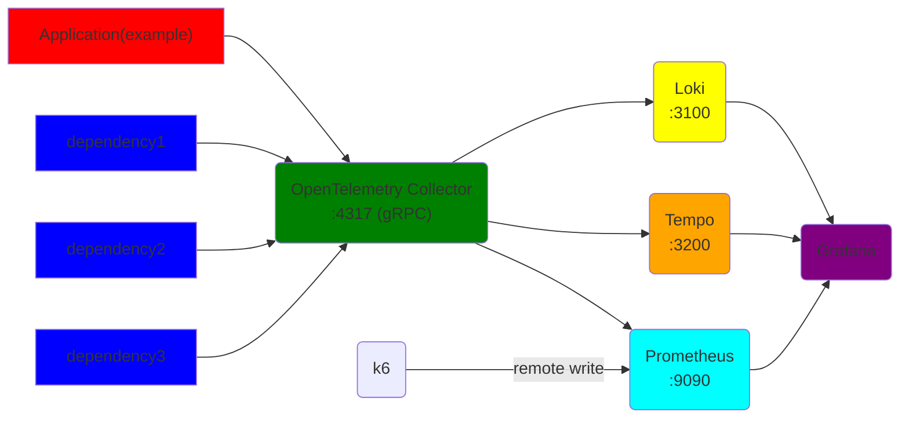
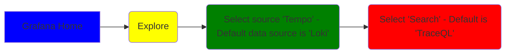

# OpenTelemetry Workshop
This setup originally is based on: https://github.com/open-telemetry/opentelemetry-collector-contrib/tree/main/examples/demo

## Run Infrastructure - Getting started

### 1. Verify prerequisites
* Docker is running? Run `docker ps`. You should not get any errors-
  * `error during connect` means Rancher Desktop/Podman Desktop/Docker Desktop has not been starterd
* Docker-Compose is installed? Run `Docker-Compose -v`
* Dotnet is installed? `dotnet --version`. This should display the version.

### 2. Run the infrastructure
* Start by running `docker compose up` add `-d` to run detatched (just start it without displaying all logs)
* To clean up any docker container run `docker-compose down` from this folder.

### 3. Run the demo application - ExampleApi
Run it with `dotnet run` or inside an IDE. This will give you more about URLs you can visit.

### 4. Run a test to verify the setup
Go to [localhost:5000/test](http://localhost:5000/test)

## setup

### Prerequisites
* Tool for building and running containers, e.g. Docker Desktop, Podman or Rancher Desktop - Including Compose.
* Dotnet 8

### Overall Architecture


- Your application, called example, send data directly to the OTEl collector over gRPC
- The "legacy" dependencies use autoinstrumentation and do the same
- Prometheus scrapes data from the OTEL collector
- Collector writes data to Loki and Tempo
- Grafana uses the 3 sources to display data
- k6 writes to prometheus using remote write

### Versions
Versions are defined in [.env](./.env)

Note 09.06.2024: Tempo is currently running version 2.4.2. The latest version 2.5.0 have breaking changes related to the ownership of `Ownership of /var/tempo`. This was causing issues. Refer to https://github.com/grafana/tempo/releases/tag/v2.5.0 for more info.

### Alternative to this setup
Grafana has release a simplified setup with a single container, This is found here: https://github.com/grafana/docker-otel-lgtm/.

## Instrumentation - What are our options?
There are 2 options for setting up OpenTelemetry in .NET applications.
* Setup with code with the option of using both manual and automatic instrumentation
* No-code automatic setup of automatic instrumentation. Manual instrumentation cannot be added

### Manual setup
The example app uses this setup. Refer to [SetupOpentelemetry](source/example/SetupOpentelemetry.cs) to see how this may be done. For more infomation and examples refer to
* https://opentelemetry.io/docs/languages/net/

The self-paced tasks focus on the manual setup.

### Automatic instrumentation
This setup has include 3 containers (dependency1..3) with automatic instrumentation. The 2 main solutions for doing this is:
* Download and run `otel-dotnet-auto-install.sh` or `OpenTelemetry.DotNet.Auto.psm1` or
* Include Nuget `OpenTelemetry.AutoInstrumentation`

We have used the latter approch. Refer to dependency1 [docker-compose.yaml](./docker-compose.yaml) for an example. This example includes ENV variables for easier debugging.

For more information refer to:
* https://opentelemetry.io/docs/zero-code/net/


## Example App
```
    .
    ├── exampleAPI.http        <- To run HTTP command. An alternative to using Swagger or browser
    ├── MapRoutesExtensions.cs <- Sets up the routes
    ├── SetupOpentelemetry.cs  <- All OpenTelemetry setup for Logging, Tracing and Metrics
    └── Program.cs...          <- All the normal stuff
```

Startup app and go to `http://localhost:5000/`

## Grafana and some fundamentals for viewing data

Grafana shows the data using 3 data sources:
* Tempo for tracing
* Prometheus for metrics
* Loki for Logging

PS: Message `Failed to authenticate request` might appear. This should not have any impact, but is noisy. Go to `Sign in` in the top right corner and sign in with user and password, `admin` and `admin`

Before looking at data, you need to populate some data. You can do that by running some of the HTTP requests in:
* [dependencyApi.http](./source/dependency/dependencyApi.http)
* [exampleAPI.http](./source/example/exampleAPI.http) 

Then open Grafana on [localhost:3000](http://localhost:3000)

### Tempo - Tracing - Connecting components

Read more about TraceQL here: https://grafana.com/docs/tempo/latest/traceql/

Should look something like this:


### Prometheus - Metrics - Statistics

Prometheus uses PromQL as a query language. Here are some examples: https://prometheus.io/docs/prometheus/latest/querying/examples/

You should be able to run `http_client_request_duration_seconds_count{}`. Send HTTP requests e.g. from [exampleAPI.http](./source/example/exampleAPI.http)

Should look something like this:


### Loki - Logging - Telling the story

Loki uses LogQL. Refer to https://grafana.com/docs/loki/latest/query/.
You can start by adding LogQL:  `{exporter="OTLP"}`. This will show all log records exported by the OpenTelemtry Collector


Should look something like this:


## Dashboards
* [ASP .NET OTEL Metrics](http://localhost:3000/d/ASP_NET_OTLP_COL_SHARED/asp-net-otel-metrics-from-otel-collector?orgId=1&var-job=exampleApiSetInEnv&var-instance=&var-http_client_peer_name=All&from=now-30m&to=now&refresh=1m)
  * Ref: https://grafana.com/grafana/dashboards/19896-asp-net-otel-metrics-from-otel-collector/
* [k6 Prometheus](http://localhost:3000/d/a3b2aaa8-bb66-4008-a1d8-16c49afedbf0/k6-prometheus-native-histograms?orgId=1)
  * Ref: https://grafana.com/grafana/dashboards/18030-k6-prometheus-native-histograms/
* [OpenTelemetry Collector](http://localhost:3000/d/BKf2sowmj/opentelemetry-collector?orgId=1&refresh=10s)
  * Ref: https://grafana.com/grafana/dashboards/15983-opentelemetry-collector/
* [Custom Counter](http://localhost:3000/d/c2b94126-3764-4cea-b30b-7207a0be87d9/counter-dashboard?orgId=1)

# Self-paced Tasks

## Verify Setup and getting started
### Has everything started?
* Start the infrastructure as in this [section](#run-infrastructure)
* Start the `ExampleApi`
* Verify that everything in up and running with [http://localhost:5000/test](http://localhost:5000/test)
* Open the webpage in [http://localhost:5000/](http://localhost:5000/)

### Is the .NET app connected correctly?
* Go to [Loki last 5 min](http://localhost:3000/explore?schemaVersion=1&panes=%7B%22eiw%22:%7B%22datasource%22:%22loki%22,%22queries%22:%5B%7B%22refId%22:%22A%22,%22expr%22:%22%7Bexporter%3D%5C%22OTLP%5C%22%7D%20%7C%20json%20%7C%20line_format%20%5C%22%7B%7B.resources_service_name%7D%7D%20%7B%7B.resources_service_version%7D%7D%20%7B%7B.body%7D%7D%5C%22%22,%22queryType%22:%22range%22,%22datasource%22:%7B%22type%22:%22loki%22,%22uid%22:%22loki%22%7D,%22editorMode%22:%22code%22%7D%5D,%22range%22:%7B%22from%22:%22now-5m%22,%22to%22:%22now%22%7D%7D%7D&orgId=1)
* Confirm that Service name has not been set. It should be `unknown_service:dotnet` (at this stage)
* Understand the basics for the setup. Refer to [SetupOpentelemetry.cs](./source/example/SetupOpentelemetry.cs)
  * Add `"OTEL_SERVICE_NAME": "exampleApiSetInEnv"` to env e.g. here: [launchSettings.json](./source/example/Properties/launchSettings.json)
  * Uncomment the code in for configure resources in [SetupOpentelemetry.cs](./source/example/SetupOpentelemetry.cs)
  * Did it work as expected? How to fix it?
* Verify that `ExampleApi` is also sending Metrics and Traces the OpenTelemetry Collector, by checking [Prometheus](http://localhost:3000/explore?schemaVersion=1&panes=%7B%226oa%22:%7B%22datasource%22:%22prometheus%22,%22queries%22:%5B%7B%22refId%22:%22A%22,%22expr%22:%22http_client_request_duration_seconds_sum%7B%7D%22,%22range%22:true,%22instant%22:true,%22datasource%22:%7B%22type%22:%22prometheus%22,%22uid%22:%22prometheus%22%7D,%22editorMode%22:%22code%22,%22legendFormat%22:%22__auto%22%7D%5D,%22range%22:%7B%22from%22:%22now-1h%22,%22to%22:%22now%22%7D%7D%7D&orgId=1) and [Tempo](http://localhost:3000/goto/2uq52zUSg?orgId=1) in Grafana. Refer to `section Grafana and some fundamentals for viewing data`

## Tracing
### Task T1: Reducing noise
* Locate the tracing RequestFilter in [SetupOpentelemetry.cs](./source/example/SetupOpentelemetry.cs)
* Send request to the [http://localhost:5000/remove](http://localhost:5000/remove)
* Update the request filter (input to AddElementsOpenTelemetry) to remove this endpoint
* Verify in Tempo that you succeeded.

### Task T2: Use the API and understand the delay in the execution
* send requests to the APIs
  * [http://localhost:5000/parallel](http://localhost:5000/parallel)
  * [http://localhost:5000/serial](http://localhost:5000/serial)
* It is easy understand what is causing the delay? Check if you understand it in [Tempo](http://localhost:3000/goto/2uq52zUSg?orgId=1)
* Find out why tracing is missing in `ThisNeedsToBeTraced`. Note that you need to start the activity, not only create it.

### Task T3: Use the API and get exceptions
* Send requests to 
  * [http://localhost:5000/throwEx](http://localhost:5000/throwEx)
  * [http://localhost:5000/error](http://localhost:5000/error)
* Become familiar with the different ways of tracing errors. The mapping is done in [MapRoutesExtensions.cs](./source/example/MapRoutesExtensions.cs)
* Look at the trace in [Tempo](http://localhost:3000/goto/2uq52zUSg?orgId=1)

## Metrics
### Task M1: Understanding the data flow
* I have added a custom metric to `SuperServiceWithMetrics` [SuperServiceWithMetrics.cs](./source/example/Service/SuperServiceWithMetrics.cs)
* Use the endpoint [http://localhost:5000/metric/inc/10](http://localhost:5000/metric/inc/10) to increment the custom metric.
* Are you seeing any data in [Grafana dashboard](http://localhost:3000/d/c2b94126-3764-4cea-b30b-7207a0be87d9/counter-dashboard?orgId=1)? No? Why?
* PS:  the counter `super_service_counter` produces the metric `super_service_counter_total`
* Verify that you can track the metric from the OpenTelemetry collector to Grafana-
  * Find the metric in the output of the Open Telemetry Collector [http://localhost:8889/metrics](http://localhost:8889/metrics)
  * Find the metric in prometheus:  [http://localhost:9090/graph](http://localhost:9090/graph)
  * Find the metric in Grafana: http://localhost:3000/explore [http://localhost:3000/explore](http://localhost:3000/explore)
* There is a bug in the custom metrics counter? Can you spot it? Fix it.

### Task M2: What metrics are added?
* Look into: AddAspNetCoreInstrumentation. It is called in [SetupOpentelemetry.cs](./source/example/SetupOpentelemetry.cs)
  * You can also see it here: [AspNetCoreInstrumentationMeterProviderBuilderExtensions.cs](https://github.com/vishweshbankwar/opentelemetry-dotnet/blob/ca5b3aca0e1218a589556097b0537cb97f62da98/src/OpenTelemetry.Instrumentation.AspNetCore/AspNetCoreInstrumentationMeterProviderBuilderExtensions.cs)
  * Read more about core metrics https://learn.microsoft.com/en-us/dotnet/core/diagnostics/built-in-metrics-aspnetcore
* Generally, It is a bit hard to keep track which metrics are added. Use what you learned from task M1 to see what data is actually present.
* The metrics have more than once broken the dashboards.

### Task M3: Add a custom metric
* Add another counter to the setup 
* Verify that this has been added to your metrics

## Logging
### Task L1: Add Logging and understand the log record
* Open [/parallel](http://localhost:5000/parallel)
* Open [Loki with LogQL {exporter="OTLP"}](http://localhost:3000/explore?schemaVersion=1&panes=%7B%22eiw%22:%7B%22datasource%22:%22loki%22,%22queries%22:%5B%7B%22refId%22:%22A%22,%22expr%22:%22%7Bexporter%3D%5C%22OTLP%5C%22%7D%22,%22queryType%22:%22range%22,%22datasource%22:%7B%22type%22:%22loki%22,%22uid%22:%22loki%22%7D,%22editorMode%22:%22code%22%7D%5D,%22range%22:%7B%22from%22:%22now-30m%22,%22to%22:%22now%22%7D%7D%7D&orgId=1)
  * Get to know the log record. Some key fields are:
    * body
    * severety
    * attributes
    * resources
    * instrumentation scope name
* Open [/metric/inc/10](http://localhost:5000/metric/inc/10)
  * How did instrumentation scope change?
* Stop the application
  * Look at the log record with body "Application is shutting down...". Does it have spanid and traceid? Why?
* PS: LogQL `{exporter="OTLP"} | json | line_format "{{.body}}"` gives a clean prinout of log record body. Try this. Observe how the log records are flattended

### Task L2: Find Traces from log record
* Send request to [http://localhost:5000/parallel](http://localhost:5000/parallel)
* Go to log lines created during this request processing, and find the trace ID
* Go to the trace in Tempo.

### Task L3: Using scopes
* Go to [SuperService.cs](./source/example/Service/SuperService.cs), and add `logger.BeginScope`
* What do you see in Loki. What and where is the scope state added in the log record?
* Advanced/optional:
  * Try to duplicate the scope call
  * Do you see the duplicated entry?
  * What do you get if you mutate the value (and not the key) `logger.BeginScope`
  * Look at the log record in the custom processer in [SetupOpentelemetry.cs](./source/example/SetupOpentelemetry.cs)
  * And look in he OtlpLogRecordTransformer. Can you find the duplicated attribute key?

### Task L4: Include formatted message?
* Go to [SetupOpentelemetry.cs](./source/example/SetupOpentelemetry.cs), and set `IncludeFormattedMessage = false` in the configuration of the logging.
* Open [/parallel](http://localhost:5000/parallel)
* Go to Loki and observe how the body changes.

## Bonus
### Task B1: Run k6 test and observe the system under load
* Install k6. E.g. by running this https://dl.k6.io/msi/k6-latest-amd64.msi
* Docs: https://k6.io/docs/
* Run the test with `K6_PROMETHEUS_RW_SERVER_URL=http://localhost:9090/api/v1/write K6_PROMETHEUS_RW_TREND_AS_NATIVE_HISTOGRAM=true k6 run -o experimental-prometheus-rw test/script.js`
* View the result in the dashboard called `k6 Prometheus`

### Task B2: Configure using Signal specific AddOtlpExpoerter methods
* Update [SetupOpentelemetry.cs](./source/example/SetupOpentelemetry.cs) to use signal-specific (Logging, Trace, Metrics) setup of OTLP exporter.

### Task B3: Debugging
* Add the debug exporter to the pipeline in the [OTEL collector config](./config/otel-collector-config.yaml)
  * traces
  * Logging
  * traces

## Where can I go from here?
You can e.g. 
* Test with sampling https://github.com/open-telemetry/opentelemetry-collector-contrib/blob/main/processor/probabilisticsamplerprocessor/README.md
* Check out frontend instrumentation using Faro https://github.com/grafana/faro-web-sdk
* Replace the OTEL collector with Alloy https://grafana.com/docs/alloy/latest/
* Check out the .NET Aspire dashboard. 