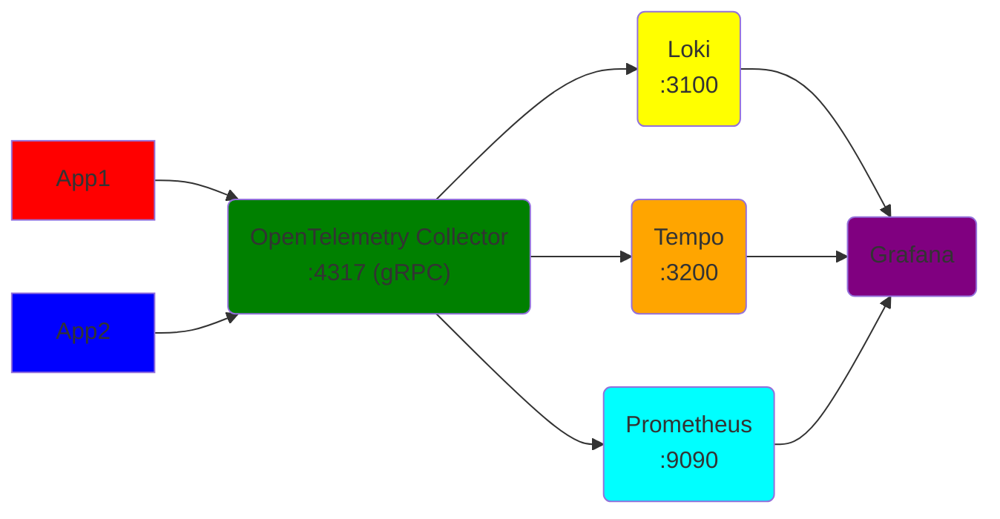

# OpenTelemetry Workshop
This setup is based on: https://github.com/open-telemetry/opentelemetry-collector-contrib/tree/main/examples/demo

## Alternative setup
If you want a simplified setup with a single container, you can use https://github.com/grafana/docker-otel-lgtm/. This is mained by Grafana.

## Prerequisites
* Tool for building and running containers, e.g. Docker Desktop, Podman or Rancher Desktop - Including Compose.
* Dotnet 8

## Architecture

- Your application send data directly to the OTEl collector over gRPC
- Prometheus scrapes data from the OTEL collector
- Collector writes data to Loki and Tempo
- Grafana uses the 3 sources to display data

## Run Infrastructure

Start by running `docker compose up` add `-d` to run detatched (just start it without displaying all logs)
To clean up any docker container run `docker-compose down` from this folder.

## Run the demo application - ExampleApi
Run it with `dotnet run` or inside an IDE. This will give you more about URLs you can visit.

More background about setup in Dotnet is found here: https://opentelemetry.io/docs/languages/net/getting-started/#instrumentation

# Doing Stuff
## Verify prerequisites
* Docker is running? Run `docker ps`. You see `CONTAINER ID` and a lot of other stuff.
  * `error during connect` means Rancher Desktop/Podman Desktop/Docker Desktop has not been starterd
* Docker-Compose is installed? Run `Docker-Compose -v`
* Dotnet is installed? `dotnet --version`. This should display the version.
  * If this fails, but you have `Visual Studio` installed, just run from inside `Visual Studio`. PS: `Visual Studio` is not the same as `Visual Studio Code`

## .NET - Tracing
To look at the traces go to ´Grafana´ and open ´Explore´, and choose ´Tempo´ as data source. Make sure tab ´Search´ is chosen, and not ´TraceQL´

### Task 1: Get it up and running
* Start the infrastructure as in this [section](#run-infrastructure)
* Start the `ExampleApi`
* Open the webpage in `ExampleApi` and become familiar with the links

### Task 2: Is it connected?
* Understand the setup
  * Refer to all comments starting with "SETUP"
* Verify that `ExampleApi` is sending Metrics and Traces to the OpenTelemetry
  * How did you verify it?
* Try changing the ENV-variable `collector`
  * What happend?

### Task 3: Reducing noise
* Try disabling the RequestFilter
* (use swagger) to send requests to the APIs
  * `/remove`
* Update the request filter (input to AddElementsOpenTelemetry) to remove this endpoint
* Verify in Tempo that you succeeded.

### Task 4: Use the API and understand the delay
* (use swagger) to send requests to the APIs
  * `/parallel`
  * `/serial`
* (Use Jaeger) to understand what is causing the delay?
* Find out why tracing is missing in `ThisNeedsToBeTraced` 

### Task 5: Use the API and get exceptions
* (use swagger) to send requests to the APIs
  * `/error`
* Look at trace in Jaeger and add imprevements

## .NET Metrics
### Task 21: Understanding the data flow
* I have added a custom metric to `SuperServiceWithMetrics`
* Use the endpoint `/metric/inc` to increment this. Refer to swagger.
* Verify that this is working
  * Find the metric in the output of the Open Telemetry Collector http://localhost:8889/metrics
  * Find the metric in prometheus: http://localhost:9090/graph
  * Find the metric in Grafana: http://localhost:3000/explore

### Task 22: Add a custom metrics
* Add another counter to the setup
* Verify that this has been added to your metrics

### Agnostic Bonus 1: Run k6 test and observe the system under load
* Install k6. E.g. by running this https://dl.k6.io/msi/k6-latest-amd64.msi
* Docs: https://k6.io/docs/
* Update URL in `script.js` located inside the `test`-folder - `k6 run script.js`
* See if you can make the application struggle a bit by e.g. run the script for a longer period of time.
